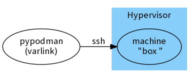

# Podman Machine

Machine lets you create Podman hosts on your computer.
It creates servers with Podman on them, then
configures the Podman client to talk to them.



## Download

Binaries can be found in: https://github.com/boot2podman/machine/releases

Get the version for your operating system and architecture, and put it in your path:

### Linux (GNU)

`podman-machine.linux-amd64 -> podman-machine`

### Darwin (OS X)

`podman-machine.darwin-amd64 -> podman-machine`

### Windows

`podman-machine.windows-amd64.exe -> podman-machine.exe`

You also need a supported Virtual Machine environment, such as [VirtualBox](https://virtualbox.org) or [QEMU](https://qemu.org).

Additional VM environments are possible too, after installing third party machine drivers.

## Getting Started

``` console
$ podman-machine create -d virtualbox box
Running pre-create checks...
Creating machine...
(box) Creating VirtualBox VM...
(box) Creating SSH key...
(box) Starting the VM...
(box) Check network to re-create if needed...
(box) Waiting for an IP...
Machine "box" was started.
```

``` console
$ podman-machine ssh box
        .---.        b o o t 2                 mm             https://podman.io
       /o   o\                                 ##                              
    __(=  "  =)__    ##m###m    m####m    m###m##  ####m##m   m#####m  ##m####m
     //\'-=-'/\\     ##"  "##  ##"  "##  ##"  "##  ## ## ##   " mmm##  ##"   ##
        )   (        ##    ##  ##    ##  ##    ##  ## ## ##  m##"""##  ##    ##
       /     \       ###mm##"  "##mm##"  "##mm###  ## ## ##  ##mmm###  ##    ##
  ____/  / \  \____  ## """      """"      """ ""  "" "" ""   """" ""  ""    ""
 `------'`"`'------' ##                                                art: jgs
tc@box:~$ sudo podman run busybox echo hello world
Trying to pull docker.io/busybox:latest...Getting image source signatures
Copying blob sha256:90e01955edcd85dac7985b72a8374545eac617ccdddcc992b732e43cd42534af
 710.92 KB / 710.92 KB [====================================================] 0s
Copying config sha256:59788edf1f3e78cd0ebe6ce1446e9d10788225db3dedcfd1a59f764bad2b2690
 1.46 KB / 1.46 KB [========================================================] 0s
Writing manifest to image destination
Storing signatures
hello world
tc@box:~$ exit
```

## Connecting


### podman

You can run the `podman` command over ssh:

``` console
$ podman-machine ssh box -- sudo podman version
```

Show the available commands using the help:

``` console
$ podman-machine ssh box -- sudo podman --help
```

### pypodman

Or you can use the `pypodman` tool remotely:

``` bash
$ eval $(podman-machine env box)
$ pypodman version
$ pypodman --help
```

This will use environment variables to connect.

See https://github.com/containers/libpod/tree/master/contrib/python

### varlink

Connect directly with `varlink` over the bridge:

``` bash
$ eval $(podman-machine env box --varlink)
$ varlink call io.podman.GetVersion
$ varlink help io.podman
```

You might need `--bridge="$VARLINK_BRIDGE"`.

See https://github.com/varlink/libvarlink/tree/master/tool

## Accessing files

Only files on the virtual machine are seen by containers.

There is currently no access to any network filesystems.

In order to copy files, you can use the command `scp`:

`podman-machine scp [machine:][path] [machine:][path]`

To mount files locally using [SSHFS](https://github.com/libfuse/sshfs), you can use `mount`:

`podman-machine mount [machine:][path] [mountpoint]`

In order to make files persist, they need to be on a disk.

The default mountpoint (for /dev/sda1) is: `/mnt/sda1`

## Installing tools

If you need to install e.g. `git`, you can download and install it:

``` console
$ tce-load -wi git
git.tcz.dep OK
...
git.tcz: OK
$ git --version
git version 2.18.0
```

This was for the default tinycore distro, other ISO might differ...

## Driver Plugins

These core driver plugins are bundled:

* None
* VirtualBox
* QEMU (KVM)

It is possible to add standalone drivers.

## Cloud Drivers

Cloud drivers are explicitly **not** supported.

Please use [Kubernetes](https://kubernetes.io) for that, instead.

## Inspiration

Podman Machine is inspired by [Docker Machine](https://github.com/docker/machine), which is
a similar solution but for another popular container runtime.

Docker Machine is Copyright 2014 Docker, Inc.

Licensed under the [Apache License, Version 2.0](http://www.apache.org/licenses/LICENSE-2.0)
